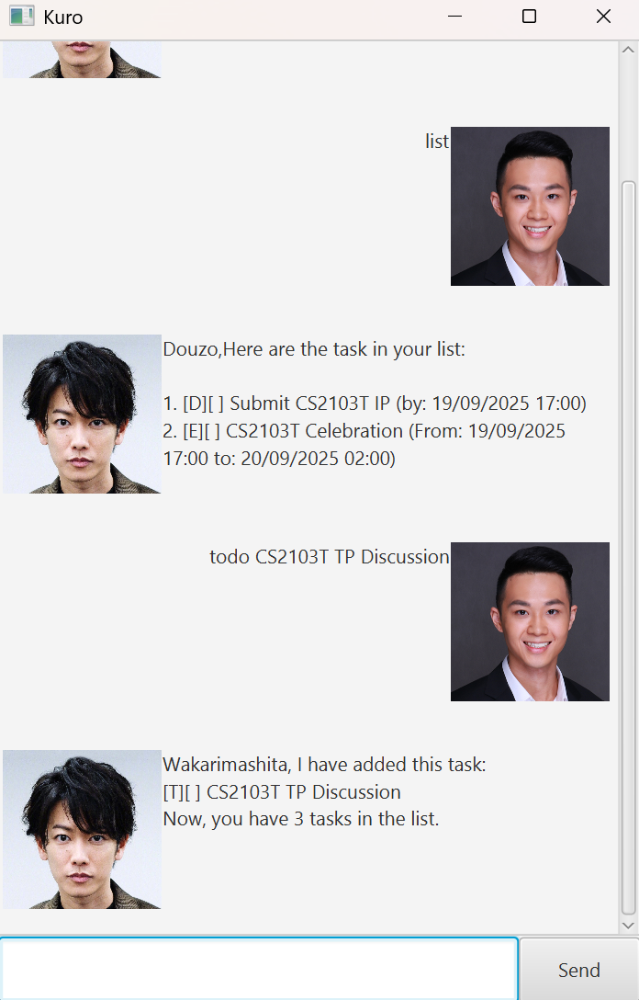

# Kuro User Guide

<!--- // Update the title above to match the actual product name -->

<!--- // Product screenshot goes here -->

<!-- // Product intro goes here --> 

Kuro is a **personal task management** chatbot with GUI that helps you stay organized and productive.
Using simple text commands, you can:
- List all your task
- Add new tasks
- Delete tasks you no longer need
- Mark tasks as done
- Unmark tasks if needed
- Filter out a specific task with fuzzy search

Kuro currently supports multiple task types:
1. Todos: simple tasks without specific timeline
2. Deadlines: tasks with a due date
3. Events: Tasks with start and end times

Whether you are managing school, work or personal goals, Kuro can help you easily keep track of everything in one place

## Adding Todos

<!--- // Describe the action and its outcome. -->
You can add a todo task with `todo [description]` command.

<!--- // Give examples of usage -->
Example: `todo Start TP discussion`

<!--- // A description of the expected outcome goes here -->
Expected output:
```
____________________________________________________________
Wakarimashita, I have added this task:
[T][ ] Start TP discussion
Now, you have 1 tasks in the list.
____________________________________________________________
```
## Adding deadlines

<!--- // Describe the action and its outcome. -->
You can add a deadline task with `deadline [description] /by [deadline]` command.

// Give examples of usage -->
Example: `deadline Submit CS2103T IP /by 2025-09-19 17:00`

<!--- // A description of the expected outcome goes here -->
Expected output:
```
____________________________________________________________
Wakarimashita, I have added this task:
[D][ ] Submit CS2103T IP (by: 19/09/2025 17:00)
Now, you have 1 tasks in the list.
____________________________________________________________
```

## Adding Events

<!--- // Describe the action and its outcome. -->
You can add a Event task with `Event [description] /from [start date] /to [end date]` command.

<!--- // Give examples of usage -->
Example: `event CS2103T Celebration /from 2025-09-19 17:00 /to 2025-09-20 02:00`

<!--- // A description of the expected outcome goes here -->
Expected output:
```
____________________________________________________________
Wakarimashita, I have added this task:
[E][ ] CS2103T Celebration (From: 19/09/2025 17:00 to: 20/09/2025 02:00)
Now, you have 1 tasks in the list.
____________________________________________________________
```

## Listing tasks

<!--- // Describe the action and its outcome. -->
You can get Kuro to display all your tasks with `list` command.

<!--- // Give examples of usage -->
Example: `list`

<!--- // A description of the expected outcome goes here -->
Expected output:
```
____________________________________________________________
Douzo,Here are the task in your list:

1. [D][ ] Submit CS2103T IP (by: 19/09/2025 17:00)
2. [T][ ] Start TP discussion
3. [E][ ] CS2103T Celebration (From: 19/09/2025 17:00 to: 20/09/2025 02:00)
____________________________________________________________
```

## Marking a task as completed

<!--- // Describe the action and its outcome. -->
You can have Kuro mark a task as completed with `mark [task number]` command.

<!--- // Give examples of usage -->
Example: `mark 2`

<!--- // A description of the expected outcome goes here -->
Expected output:
```
____________________________________________________________
Sugoi, I have marked this task as done:
[T][X] Start TP discussion
____________________________________________________________
```

## Unmarking task

<!--- // Describe the action and its outcome. -->
You can ask Kuro to unmark a specific task with `Unmark [task number]` command.

<!--- // Give examples of usage -->
Example: `unmark 2`

<!--- // A description of the expected outcome goes here -->
Expected output:
```
____________________________________________________________
Hai, I have marked this task as not done yet:
[T][ ] Start TP discussion
____________________________________________________________
```

## Deleting a task

<!--- // Describe the action and its outcome. -->
You can remove irrelevant task with `delete [task number]` command.

<!--- // Give examples of usage -->
Example: `delete 2`

<!--- // A description of the expected outcome goes here -->
Expected output:
```
____________________________________________________________
Hai, I have removed this task:
[T][ ] Start TP discussion
Now, you have 2 tasks in the list.
____________________________________________________________
```

## Finding specific task

<!--- // Describe the action and its outcome. -->
You can ask Kuro to filter your tasks to find a specific one with `find [task description]` command.

<!--- // Give examples of usage -->
Example: `find CS2103T`

<!--- // A description of the expected outcome goes here -->
Expected output:
```
____________________________________________________________
Douzo,Here are the matching tasks in your list:

1. [D][ ] Submit CS2103T IP (by: 19/09/2025 17:00)
2. [E][ ] CS2103T Celebration (From: 19/09/2025 17:00 to: 20/09/2025 02:00)
____________________________________________________________
```

## Exiting Kuro

<!--- // Describe the action and its outcome. -->
You can stop using kuro and exit with `bye` command.

<!--- // Give examples of usage-->
Example: `bye`

<!--- // A description of the expected outcome goes here -->
Expected output:
```
____________________________________________________________
Sayonara! Hope to see you again soon!
____________________________________________________________
```